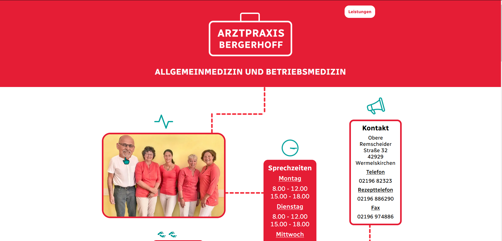

# Bergerhoff Doctor's Practice Website

[https://www.praxisbergerhoff.de/](https://www.praxisbergerhoff.de/)
 
 
 
 Having the completed the HTML and CSS sections of the Colt's Bootcamp (Udemy), I was looking for a real-world project to practice and build on what I had learned before moving on to the JavaScript section.

 A local doctor whose website was non-responsive and looked like it was created in the nineties presented such an opportunity.

 I am not so keen on the design aspect of Frontend, but this also allowed me the freedom to practice and experiment.

 ## Goals

 - [x] Build mobile-first
 For the previous small website I made for a friend, I made the mistake of starting with the desktop version, which led to layout difficulties when scaling it down to mobile. I found it much easier this time starting small and scaling up.

 - [x] Improve use of semantic markup
 Although using semantic markup is becoming more natural for me to use, I'm still somewhat unsure sometimes whether I'm using an element correctly. Using the HTML validator [https://validator.w3.org/](https://validator.w3.org/) was helpful here in catching some small mistakes that I then rectified.

 - [x] Use fluid typography / Achieve different mobile & desktop designs with seamless layout shifting between
 After reading [Modern Fluid Typography Using CSS Clamp](https://www.smashingmagazine.com/2022/01/modern-fluid-typography-css-clamp/), I wanted to see if I could build a site that scales up from mobile to desktop with minimal reliance on media queries for adjusting font sizes, image sizes, and margin sizes. For me, it seems counterintuitive to create a number of different layouts for different screen sizes. 

 - [x] Learn and experiment with simple CSS animations
 I'm unsure if using CSS animations was a good design choice here, but I wanted to use the opportunity to learn about and use them.
 They work as intended, but I suspect that some of them could probably be implemented more concisely.   

 - [x] Implement pop-up info windows using the CSS checkbox trick. 
 As I understand it, this is NOT good for accessibility and I will switch to a Javascript version once I'm able to.
 I used it here because I wanted to experiment with it and see what I could do. I have tried to make it as accessible as possible (for example, when using keyboard navigation, the pop-up windows close automatically when the user tabs away. I implemented this solution once I realized that it's not possible to activate the label via keyboard.)
 
 - [x] Gain experience with actually hosting the site and working with Meta tags, Lighthouse, improving performance, autoprefixer, adding sitemap, validating code, improving CLS with font style matching etc.
 I picked up a lot of tips and tricks from this [youtube video](https://www.youtube.com/watch?v=ivKJthatF70&list=PLMPdeA59PPg3KvGr7ACBhxSKH-1FYIZ3n&index=4&t=1s)
 The main challenge I faced was a slow Largest Contentful Paint speed from the Lighthouse report. This was due to the group photo and led me to learning about and serving two different image sizes with srcset. I had some difficulty understanding Device Pixel Ratio and achieving results in a way I could expect and understand. Although, I'm still a little shaky in this regard, I feel I now have a good foundation to build on. 

